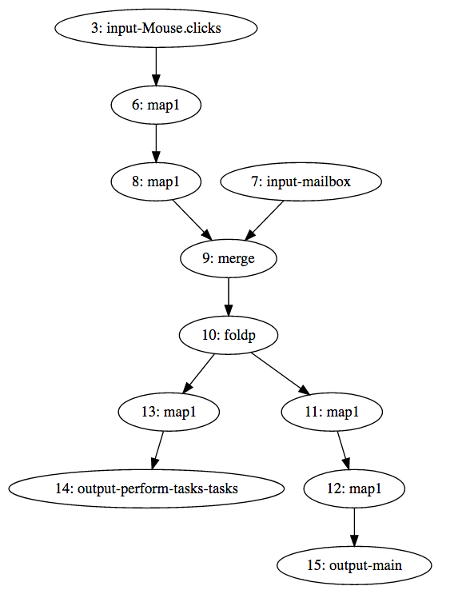

# elm-signal-graph
Instrument an Elm StartApp-based app to show signal graph and signal notifications

Add code to the javascript generated by the Elm compiler to extract information
about the signal graph and about notifications in the graph at runtime.

The method for determining and displaying the signal graph comes from 
[an elm-discuss message](https://groups.google.com/d/msg/elm-discuss/_FtTHpTea4k/L1szwMd0BQAJ).

See the Makefile for the rule that generates elm-instrumented.js from elm.js.

### Example signal graph

### Example console log

See [here](assets/example.log) for example log.
